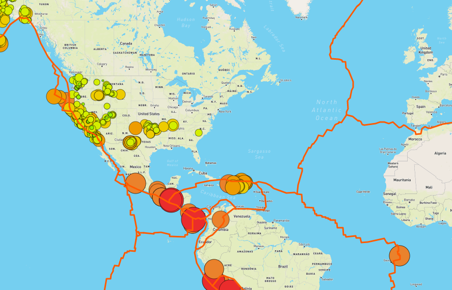
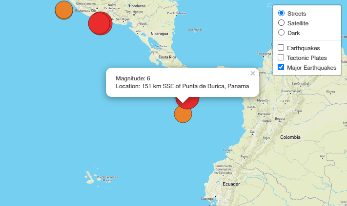
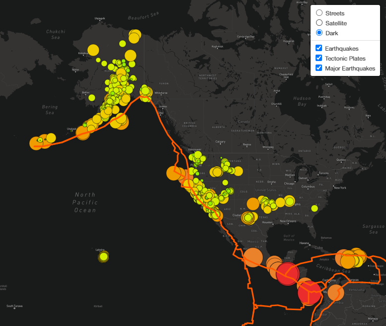

# Challenge - Mapping Earthquakes

## Challenge - Overview

Our goal in this module was to create an interactive webpage that displayed earthquake data from the last 7 days. This data would be turned into circle markers that were overlaid on a map of the world and each marker's size and colour would be dependant on the magnitude of the corresponding earthquake. To do this we would pull the data in the GeoJSON format using the D3 JavaScript module, and then display it on the map using the JavaScript module Leaflet which would make an API call to Mapbox for the map. We would create layers to display different maps and a number of different overlays for users to choose from.

## Challenge - Deliverable 1 - Tectonic Plate Data

For the first challenge we needed to add Tectonic Plate Data to our map of earthquakes. We did this by performing another D3 JSON data call within the `then()` function of the earthquake data call, and then plotted the returned GeoJSON data. We needed to create a new `LayerGroup` to store the rendered data in, and added that group to our `overlays` control object. We use the Leaflet `geoJSON()` function to understand and render the data, and then add it to the `tectonicPlates` layer. By default we want the plate lines showing we also add it to the map, the users will have an option to hide this rendered data if they wish. The tectonic plate data contained `LineString` objects, meaning our styling would effect the lines that Leaflet rendered. Here's how we did this:

```js
d3.json("https://raw.githubusercontent.com/fraxen/tectonicplates/master/GeoJSON/PB2002_boundaries.json").then(function(tData) {
  L.geoJSON(tData, {
    color: "#ff5a00",
    weight: 3
  }).addTo(tectonicPlates);
});

tectonicPlates.addTo(map)
```

And displayed on the map:



## Challenge - Deliverable 2 - Major Earthquake Data

For this deliverable we wanted to distinguish all of the earthquakes from the major ones - `>4.5` magnitude. To do this we performed another data call, this time from the dataset containing the major earthquakes. We also changed our styling options to only colour those greater than 5 and then greater than 4, rather than trying to style data that didn't exist. As with the tectonic plate data we added another `LayerGroup` and then added that to our `overlays` object, so users could choose to display it. Mirroring the styling from the module we also included popups for the user when they clicked on an earthquake marker, this was done with the `onEachFeature` parameter:

```js
onEachFeature: function(feature, layer) {
    layer.bindPopup("Magnitude: " + feature.properties.mag + "<br>Location: " + feature.properties.place);}
```

And we can see this data displayed:



## Challenge - Deliverable 3 - Adding an Additional Map

For this deliverable we just needed to add the option of a third type of map. This meant using a different Mapbox style in our `tileLayer` API call, and in our case we chose the `dark-v10` map. We also had to add this new map styles to our `baseMaps` object so that we would have the option on the webpage.



## Context

This is the result of Module 13 of the University of Toronto School of Continuing Studies Data Analysis Bootcamp Course - **JavaScript and D3/leaflet with Mapbox** - Mapping Earthquakes with JS and APIs. Following the guidance of the module we end up pushing this selection of files to GitHub.
